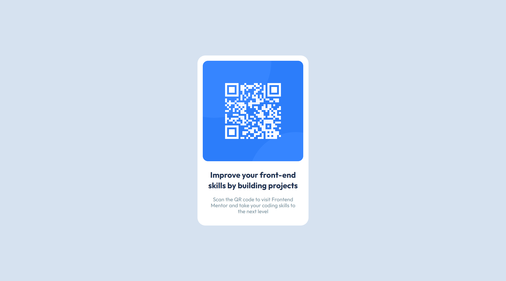
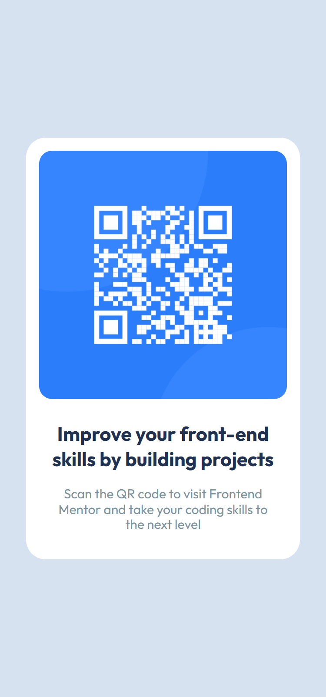

# QR Code Component Challenge

## Table of contents

- [Overview](#overview)
  - [The Challenge](#the-challenge)
  - [Screenshots](#screenshots)
  - [Links](#links)
- [My Process](#my-process)
  - [Built with](#built-with)
- [Author](#author)

## Overview

### The Challenge

- The challenge is to build out this QR code component and get it looking as close to the design as possible.

### Screenshots

| Desktop View                            | Mobile View                           |
| --------------------------------------- | ------------------------------------- |
|  |  |

### Links

- Solution URL: [QR Code Component](https://frontendmentor.io/purrrplelipton/newsletter-signup/)
- Live Site URL: [QR Code Component](https://purrrplelipton.github.io/newsletter-signup/)

## My process

### Built with

- Semantic HTML5 markup
- Flexbox
- Mobile-first workflow

## Author

- Website - [Emmanuel Adeyeye](https://tobiii.vercel.app)
- Frontend Mentor - [@purrrplelipton](https://www.frontendmentor.io/profile/purrrplelipton)
- Twitter - [@purrrplelipton](https://www.twitter.com/purrrplelipton)
